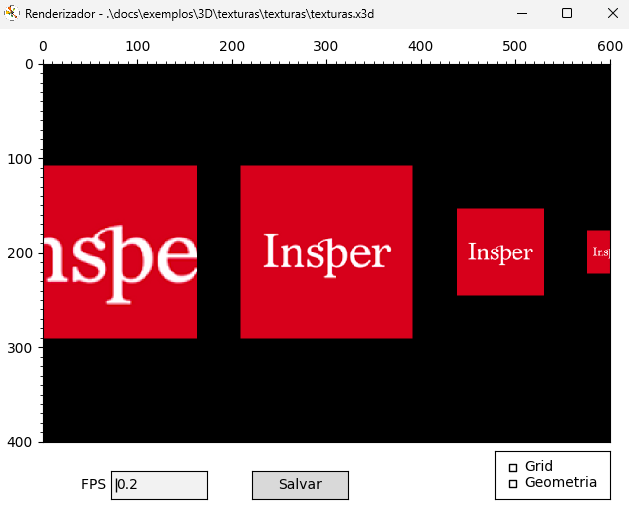

# Renderizador
Este repositório contém um **renderizador por software (CPU)** escrito em Python, desenvolvido em etapas (Projetos **1.1 → 1.5**) para a disciplina de Computação Gráfica. A cada etapa ampliamos o pipeline, saindo da rasterização 2D até um pipeline 3D com **malhas indexadas, z-buffer, transparência, texturas e iluminação** com animação.

**Escopo por etapas**  
- **1.1 — 2D**: pontos, linhas (Bresenham) e triângulos em wireframe.  
- **1.2 — 3D básico**: pipeline **Model · View · Projection → NDC → viewport** e preenchimento de triângulos.  
- **1.3 — Malhas**: `triangleStripSet`, `indexedTriangleStripSet` e `indexedFaceSet` (triangulação por *fan*).  
- **1.4 — Aparência**: **interpolação de cores**, **z-buffer**, **transparência (source-over)** e **texturas 2D** com UVs perspectiva-correta.  
- **1.5 — Iluminação/Animação**: luz **direcional** e **pontual** (Lambert + Blinn-Phong), materiais (`emissive/diffuse/specular/shininess`), normais por vértice/face e **loop de animação** para cenas dinâmicas (ex.: onda, pirâmide, senoide).

**Arquitetura (visão geral)**  
- `gl.py`: “GPU” emulada (pipeline, rasterização, z/SSAA, texturas, luzes).  
- `x3d.py`: carregamento do grafo de cena X3D e *traversal*.  
- `renderizador.py`: *entry point* e orquestração do frame.  
- `interface.py`: janela/preview e captura de frames.


# Projeto 1.1 — Rasterização 2D


## Implementações
Foram implementadas as seguintes funções em `gl.py`:
- **polypoint2D**: renderiza pontos recebendo pares (x, y).
- **polyline2D**: renderiza segmentos de reta conectando pontos consecutivos, usando o algoritmo de Bresenham.
- **triangleSet2D**: renderiza triângulos 2D, desenhando suas arestas com Bresenham.

## Decisões de Implementação
- Adicionei checagem de limites antes de desenhar (`if 0 <= x < width and 0 <= y < height`) para evitar acessos inválidos ao framebuffer.
- As cores são normalizadas de acordo com o campo `emissiveColor` (valores 0..1 convertidos para 0..255).
- Triângulos por enquanto são desenhados apenas pelas **arestas** (preenchimento será feito em projetos posteriores).

## Como Executar
Para rodar alguns dos exemplos de validação do 1.1:

```bash
# pontos
python3 renderizador/renderizador.py -i docs/exemplos/2D/pontos/aleatorios/aleatorios.x3d -w 600 -h 400 -p

# linhas
python3 renderizador/renderizador.py -i docs/exemplos/2D/linhas/linhas_cores/linhas_cores.x3d -w 600 -h 400 -p

# triângulos
python3 renderizador/renderizador.py -i docs/exemplos/2D/triangulos/triangulos/triangulos.x3d -w 600 -h 400 -p

```


# Projeto 1.2 — Pipeline 3D básico


## Implementações
Foram implementadas as seguintes funções em `gl.py`:
- **triangleSet**: rasteriza triângulos **3D preenchidos** após transformar para tela (MVP → NDC → viewport).
- **viewpoint**: constrói a matriz de **View** como a inversa rígida de `C = T(eye) · R(axis,angle)` e define a **Projection** perspectiva (`fieldOfView`, `aspect`, `near`, `far`).
- **transform_in**: compõe e **empilha** a matriz de **Model** com `T · R · S` (ordem do nó), respeitando a hierarquia do grafo de cena.

## Decisões de Implementação
- **Pilha de matrizes** para o Model; ordem de composição: `Model = Parent · (T · R · S)`.
- **Viewport mapping**:  
  `x_screen = (x_ndc*0.5 + 0.5) * (width - 1)`  
  `y_screen = (-y_ndc*0.5 + 0.5) * (height - 1)` (inversão de Y para a tela).
- **Rasterização** por **função de aresta** (teste baricêntrico por sinal) em coordenadas de tela.

## Como Executar
Para rodar os exemplos de validação do 1.2:

```bash
# um triângulo 3D (sólido)
python3 renderizador/renderizador.py -i docs/exemplos/3D/malhas/um_triangulo/um_triangulo.x3d -w 800 -h 600 -p

# vários triângulos (testa T·R·S e hierarquia)
python3 renderizador/renderizador.py -i docs/exemplos/3D/malhas/varios_triangs/varios_triangs.x3d -w 800 -h 600 -p

# zoom (testa fieldOfView do Viewpoint)
python3 renderizador/renderizador.py -i docs/exemplos/3D/malhas/zoom/zoom.x3d -w 800 -h 600 -p
```

# Projeto 1.3 — Strips e Malhas Indexadas

## Implementações
Foram implementadas as seguintes funções em `gl.py`:
- **triangleStripSet**: rasteriza **faixas de triângulos** a partir de `point` (lista de vértices xyz) e `stripCount` (tamanho de cada tira), alternando a orientação (winding) a cada triângulo.
- **indexedTriangleStripSet**: rasteriza **faixas indexadas**; o vetor `index` usa **`-1`** para separar tiras.
- **indexedFaceSet**: rasteriza **faces indexadas** triangulando por *fan* (`0, i-1, i`) a partir de `coord`/`coordIndex`.  
  > Suporte simples a `colorPerVertex`: quando houver paleta (`color`/`colorIndex`), é usada cor **flat por face** (a do primeiro vértice da face).

## Decisões de Implementação
- Reuso do pipeline do 1.2: `MVP → NDC → viewport`, com preenchimento via **função de aresta** (baricêntricas por sinal) em coordenadas de tela.
- **TriangleStrip**: alternância de winding por paridade mantendo a orientação consistente.
- **IndexedTriangleStrip**: novas tiras começam em cada **`-1`** do vetor `index`.
- **IndexedFaceSet**: triangulação **fan** por face; sem recorte/clipping por plano nesta etapa.

## Como Executar
```bash
# Strips / várias faces
python3 renderizador/renderizador.py -i docs/exemplos/3D/malhas/tiras/tiras.x3d -w 800 -h 600 -p

# Zoom (validação do Viewpoint)
python3 renderizador/renderizador.py -i docs/exemplos/3D/grafo_de_cena/girando/girando.x3d -w 800 -h 600 -p
```

# Projeto 1.4 — Cores, Z-buffer, Transparência e Texturas


## Implementações
Foram implementadas as seguintes funcionalidades em `gl.py`:

- **Interpolação de cores por vértice** (perspectiva-correta) no rasterizador `_raster_triangle` (fallback para cor **flat** quando não há `colorPerVertex`).  
- **Z-buffer** por subamostra (compatível com **SSAA 2×2**): rejeita fragmentos opacos com `z` maior/igual e grava o depth por subamostra.
- **Transparência** via **composição “source-over”** (`1 − transparency` do material): pixels **opacos** gravam z; **transparentes** apenas compõem a cor (sem gravar z).
- **Texturas 2D**:
  - Carregamento/caching (via `gpu.GPU.load_texture`) em `_get_texture_handle`.
  - Amostragem com **wrap** infinito e correção de orientação (UV → amostrador) em `_read_tex`.
  - **Interpolação de UVs perspectiva-correta** e amostragem no rasterizador `_raster_triangle_tex`.
  - **Modulação** opcional da textura pelas cores por vértice (quando `colorPerVertex`/`colorIndex` existem).
- **IndexedFaceSet com textura**: suporte a `texCoord`/`texCoordIndex` (consumo paralelo aos índices de coord., respeitando separadores `-1`) e `colorPerVertex`.

## Decisões de Implementação
- **Pipeline**: `MVP → clip → NDC → viewport`. Guardamos também `invw` por vértice para todas as interpolações **perspectiva-corretas** (cores e UVs).
- **SSAA 2×2**: offsets fixos `[(0.25,0.25), (0.75,0.25), (0.25,0.75), (0.75,0.75)]`; o **resolve** é média simples por pixel.
- **Profundidade**: comparamos em **NDC** (near = −1, far = +1) por subamostra. Transparente **não** grava z (ordem de desenho afeta o resultado, como pedido no curso).
- **Texturas**:
  - UVs com wrap (frac) e ajuste de orientação para casar com o conjunto de exemplos do curso.
  - Amostragem **nearest** (sem mipmapping/filtragem — escopo de projetos futuros).
- **Cores e transparência**:
  - Cores normalizadas para **0..255**.
  - `alpha = 1 − transparency` do material. A composição usa “source-over”.
  
## Como Executar
```bash
# Cores por vértice (degradê em quadrado)
python3 renderizador/renderizador.py -i .\docs\exemplos\3D\texturas\texturas\texturas.x3d

# Texturas (vários quadros texturizados)
python3 renderizador/renderizador.py -i .\docs\exemplos\3D\transparencia\transparente\transparente.x3d
```

# Projeto 1.5 — Iluminação (difusa/especular) e Animação


## Implementações
- **Luzes**
  - **DirectionalLight**: suporta `ambientIntensity`, `color` e `direction` (normalizado).
  - **PointLight**: suporta `color`, `location` e atenuação simples; posição transformada para espaço de mundo.
  - **Headlight/ambiente padrão**: quando a cena não define luzes, é criada uma luz ambiente/direcional fraca para evitar tela preta.
  - **Normalização de cores**: helper `GL._to01` aceita `color` em `[0..1]` ou `[0..255]`.

- **Materiais e sombreamento**
  - Modelo **Lambert + Blinn-Phong**: `I = Iamb + Idiff + Ispec`, com *clamp* em `[0,1]`.
  - **Materiais**: `emissiveColor`, `diffuseColor`, `specularColor`, `shininess`.
  - **Normais**: usa normais por vértice quando disponíveis (fallback para normal de face); renormalização após transformações.
  - **Iluminação por vértice** no caminho de `indexedFaceSet` (cores sombreadas são interpoladas no raster).

- **Animação / Loop de render**
  - **Atualização por frame** com relógio interno: permite cenas animadas (ex.: `onda.x3d`, `piramide.x3d`, `avatar_animado.x3d`).
  - Reuso do pipeline do 3D: `Model·View·Projection → NDC → viewport` + **z-buffer** e **SSAA**.

## Decisões de Implementação
- **Backface culling unificado**: desenha apenas triângulos com `area2 > 0`. 
- **Helper de cor `_to01`**: evita `AttributeError` e padroniza cores das luzes/materiais.
- **Performance**: SSAA **2×2** por padrão (qualidade).
- **Problemas com os exemplos de senoide**: a tela fica preta quando roda esses exemplos.

## Como Executar (exemplos do 1.5)
```bash
# Difuso simples (várias luzes)
python3 renderizador/renderizador.py -i docs/exemplos/3D/iluminacao/difusos/difusos.x3d -w 800 -h 600 -p

# Cena "mineiro" (materiais e luzes)
python3 renderizador/renderizador.py -i docs/exemplos/3D/iluminacao/mineiro/mineiro.x3d -w 800 -h 600 -p

# Onda animada
python3 renderizador/renderizador.py -i docs/exemplos/3D/animacoes/onda/onda.x3d -w 800 -h 600 -p
```